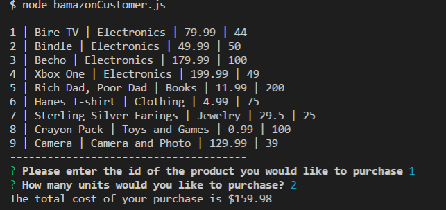
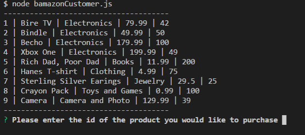
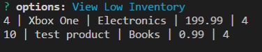
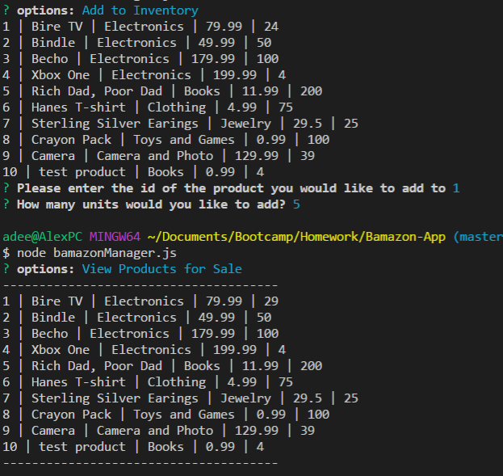
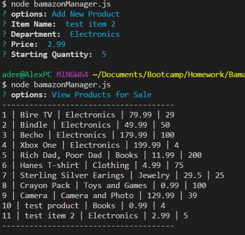

# Bamazon-App

Bamazon Customer
Bamazon is a digital marketplace application that displays to the customer the inventory and stock of items for purchase.

1. First, enter the id of the product to purchase (Ex. 1 for the Bire TV)
2. Then enter how many units to purchase
3. The total cost of the purchase is displayed, and then the application closes
4. Upon restarting the application, the inventory for that item will be depleted by the amount of units previously purchased

Bamazon Manager

View low inventory 

Add Inventory 

Add New Item 

